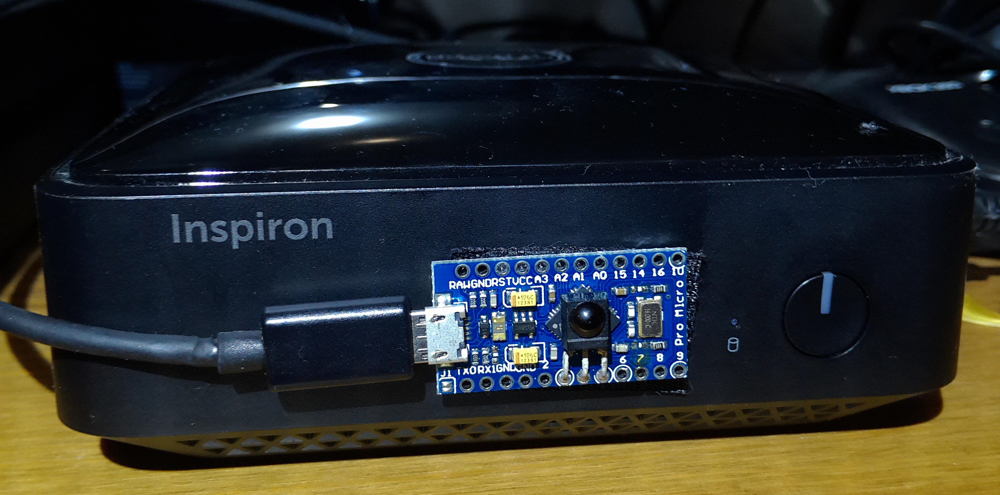

Plex Home Theatre IR remote
---------------------------

  Having found that MCE remotes cost ~£15 and an Arduino micro +
  IR receiver + Remote can be obtained for much less (or free
  in my case as I had all the parts laying around). I decided to
  make this sketch that emulates a USB keyboard to control Plex
  when it receives button presses from the remote. It could be
  easily adapted for other applications too.

  The IR codes in the sketch are from a NOW TV (Roku) remote. The
  sketch will print out any unknown IR codes it receives over the
  serial port so if you wish to program in your own remote simply
  press each button on your remote and copy down the values
  printed out.

  The default Arduino USB stack does not support waking a sleeping
  PC. To support this, I have used NicoHood's HID library.
  Instructions on how to install it can be found
  [here](https://github.com/NicoHood/HID/wiki/Installation)

  Along side this you will need to install the
  [IRremote library](https://github.com/z3t0/Arduino-IRremote)

  You may get an error message about IRremote.h existing in another
  location. This is usually benign as it will use the one you have
  installed but please check the error message to verify this.

  I have also [included](plex_steam_remote.xml) an
  [eventghost](http://www.eventghost.org/) script that I use to allow
  me to switch between Plex Home Theatre and Steam. I also used
  [InstantSheller](http://www.gameex.com/instant-sheller-and-shelling-guide/)
  to start eventghost instead of explorer, allowing to me to boot
  straight into PHT and have the ability to switch to steam via my
  remote.
